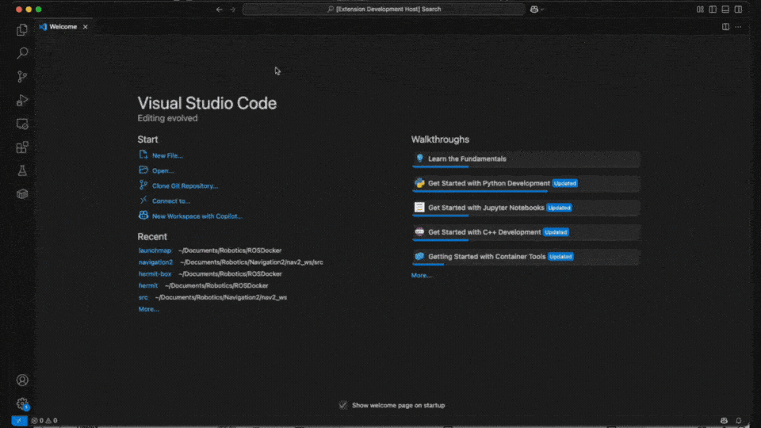

## 🚀 LaunchMap – Visualize Your ROS 2 Launch Files
<p align="center">
  
</p>

[](https://marketplace.visualstudio.com/items?itemName=KodoRobotics.launchmap)
[](./LICENSE)

**LaunchMap** is a Visual Studio Code extension that lets you visualize the structure of ROS 2 launch files as interactive graphs directly inside VSCode.

Whether you are debugging a complex `launch.py`, exploring a new package, or onboarding to a robotics stack, LaunchMap helps you **see what is really happening** in your launch files.



---

## ✨ Features

- Visualizes ROS 2 launch files as interactive graphs
- Supports core launch constructs like:
  - `Node(...)`
  - `IncludeLaunchDescription(...)`
  - `GroupAction(...)`
  - `DeclareLaunchArgument(...)`
  - `LaunchConfiguration(...)`
- Traces argument usage and include relationships
- Opens the graph in a **new tab** within VSCode
- Displays a warning banner for unsupported or skipped components
- Export and import parsed launch graphs as JSON
- Parser support for Custom ROS2 Constructs

---

## 📦 Installation

Install from the [Visual Studio Code Marketplace](https://marketplace.visualstudio.com/items?itemName=KodoRobotics.launchmap), or use the CLI:

```bash
code --install-extension KodoRobotics.launchmap
```
---

## ▶️ How to Use

1. Open an existing `.launch.py` file in VSCode.
2. Open the Command Palette (`Ctrl+Shift+P` or `Cmd+Shift+P`).
3. Run: **Open Launch Visualizer**
4. The graph will open in a new editor tab.

---

## 🚀 Quick Start Example

To test the visualizer without an existing project, you can follow these steps:

1. Create a new file named `example.launch.py`.
2. Open the file in VSCode.
3. Paste the following content and save the file:

```python
from launch import LaunchDescription
from launch_ros.actions import Node

def generate_launch_description():
    return LaunchDescription([
        Node(
            package='demo_nodes_cpp',
            executable='talker',
            name='my_talker'
        ),
        Node(
            package='demo_nodes_cpp',
            executable='listener',
            name='my_listener'
        )
    ])
```
4. With the file open, open the Command Palette.
5. Run the Open Launch Visualizer Command.

A new tab will open in VSCode, displaying an interactive graph with two nodes: `my_talker` and `my_listener`.


---

## 📤 Export & 📥 Import Launch Graph as JSON

LaunchMap supports exporting and importing launch graphs as standalone `.json` files useful for collaboration, debugging, or offline inspection.

### 💾 Export Graph to JSON

You can export the current parsed launch graph in two ways:

#### ▶️ From Command Palette
1. Open a launch file.
2. Press `Ctrl+Shift+P` / `Cmd+Shift+P`.
3. Run: LaunchMap: Export Graph as JSON.
4. Save the `launch_graph.json` file anywhere.

#### 🖼️ From the Visualizer (Webview)

Click the `💾 Export JSON` button in the top right corner of the visualizer to export the current graph.


### 📂 Import JSON to View Graph

You can also reload a previously saved `.json` graph:
1. Press `Ctrl+Shift+P` / `Cmd+Shift+P`.
2. Run: LaunchMap: Import Graph from JSON.
3. Choose any valid `launch_graph.json` file.
4. The graph will open in the visualizer, no ROS or launch file needed.

---

## 📦 Custom ROS2 Construct Support

LaunchMap supports custom plugin directories for parsing launch files. This allows you to extend parsing with additional includes or user defined launch constructs.

### 🔧 Setting the Plugin Directory

1. Press `Ctrl+Shift+P` / `Cmd+Shift+P`.
2. Run: LaunchMap: Set Plugin Directory.
3. Choose a folder containing your custom plugins.
4. LaunchMap will save the setting to a `.launchmap` file in your workspace root.

### 📌 Current Plugin Directory

LaunchMap shows the active plugin directory in the VS Code status bar:
- 📦 Plugin: my_plugins → active directory
- 📦 No Plugin Dir → none configured

Clicking the status bar item opens the Set Plugin Directory command.

### 📂 Examples

For examples, see `parser/tests/real_cases/launch_files/`.

- `turtlebot4_bringup.launch.py` demonstrates the use of `RewrittenYaml`, which is handled by `custom_handlers/rewritten_yaml_handler.py`.

More examples coming soon!

---

## ✅ Construct Support Status

A complete list of all supported launch constructs is available on the [v0.1.0 release page](https://github.com/Kodo-Robotics/launchmap/releases/tag/v0.1.0).

---

## 🪲 Troubleshooting & Having Issues

If you encounter any problems while using LaunchMap, check these common issues:

- **The visualizer does not open:** Ensure your `.launch.py` file is saved and doesn't contain any syntax errors (VSCode should highlight these). Also, verify that the LaunchMap extension is installed and enabled in VSCode.

- **The graph is empty or incomplete:** Please note that LaunchMap is under active development, and some advanced ROS 2 launch constructs are not yet fully supported. A warning banner will appear at the top of the graph if any components were skipped.

- **Encountering an error message:** Please open a new issue on the [GitHub repository](https://github.com/Kodo-Robotics/launchmap/issues) with details about the error and steps to reproduce it. Including a screenshot of the error can also be helpful!

For any other issues or unexpected behavior, we encourage you to open a new issue on GitHub. The more information you provide, the easier it is to diagnose and fix the problem.

---

## 📚 Getting Started with ROS 2

New to the ROS 2 ecosystem? Here are some great resources to get you started:

- [Official ROS 2 Documentation](https://docs.ros.org/en/rolling/)
- [ROS 2 Humble Tutorials](https://docs.ros.org/en/humble/Tutorials.html)
- [A Comprehensive Guide to ROS 2 Launch Files](https://roboticsbackend.com/ros2-launch-file-example/)
- [Articulated Robotics' ROS 2 YouTube Tutorials](https://www.youtube.com/@ArticulatedRobotics)

---

## 🤝 Contributing

Contributions are welcome!
Please open an issue, suggest a feature, or submit a pull request.
